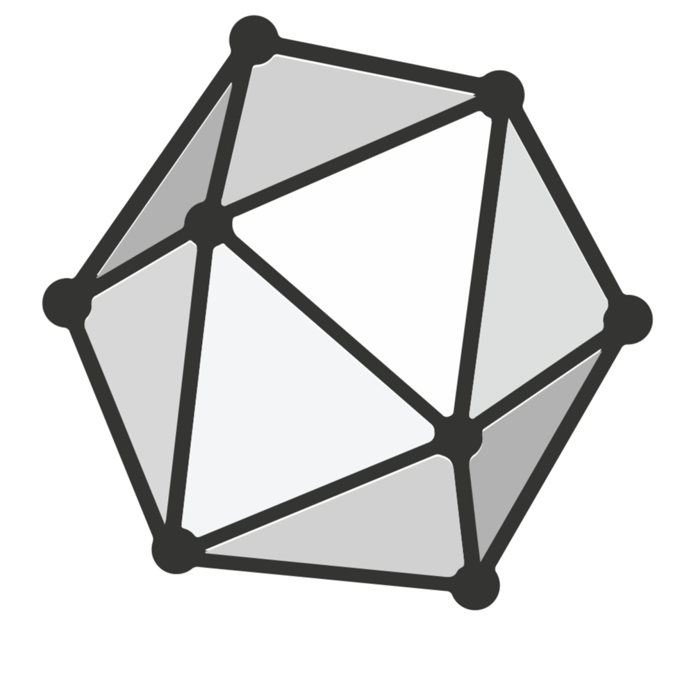
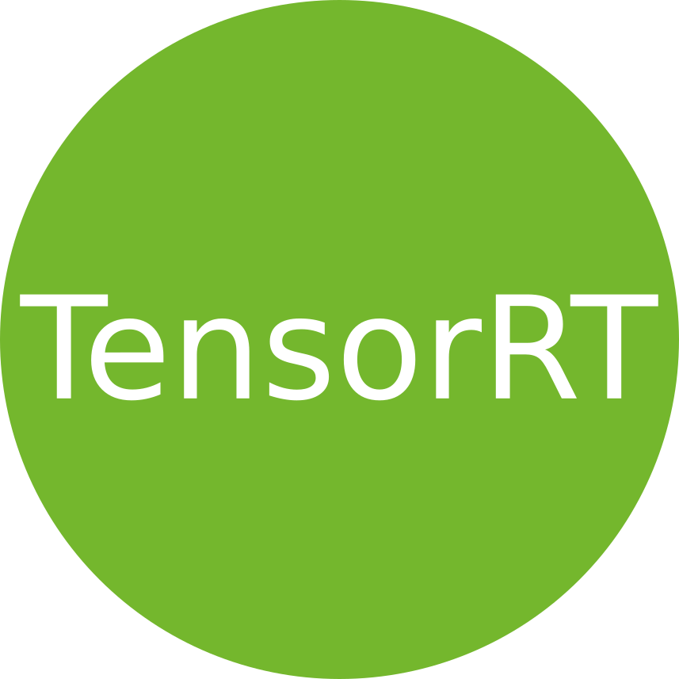

#### hey there ...
### I'm Akash_Desai 


<a href="https://www.instagram.com/akash_a_desai/">
  
</a>

<a href="https://twitter.com/1998@aks2">
  
</a>
<a href="https://www.linkedin.com/in/akash-desai-1b482b196">
  
</a>

<br />

Passionate self-taught Data scientist  and a computer vision engineer from india.

i am also an open-source enthusiast and maintainer. i learned a lot from the open-source community and i love how collaboration and knowledge sharing happened through open-source.


  
- 💼 any freelance work? do reach, [email](mailto:aksdesai1998@gmail.com) :)
- 💬 ask me about anything, i am happy to help;

**languages and tools:**  

<code></code>
<code></code>
<code></code>
<code></code>
<code></code>
<div style="display: flex; flex-wrap: wrap; align-items: center; justify-content: space-between;">





<!--  -->

<code></code>
</div>


### My Open source contribution

```yolov5: added different attension mechanisms ```

```yolov6: Added onnx to .trt (with nms / without nms ) support & video/image inference  ```

```yolov7:Added Reparameterisation steps for model conversion``` 

```
DragGan - Collab support forrunning code on google collab + gradio
```

📊 **I worked on this topics:**
<!--START_SECTION:waka-->

```text
Object detection -Darknet-yolov3,yolov4,yolov5,yolov6,yolov7,
tensorflow-resnet,mobilenet,ssd  tensorflow model zoo,detectron2-faster rcnn,mask rcnn,      

object tracking -deep sort,strong sort,sort   

image classification -vgg16,resnet,alexnet,efficientnetv1,efficientnetv2,inceptionnet v1,v2       

segmention- faster rcnn,unet

optimisation tool-Tensorrt,onnx,Neural magic
```


<!--END_SECTION:waka-->


📈 my github stats

<p align="center"> 


